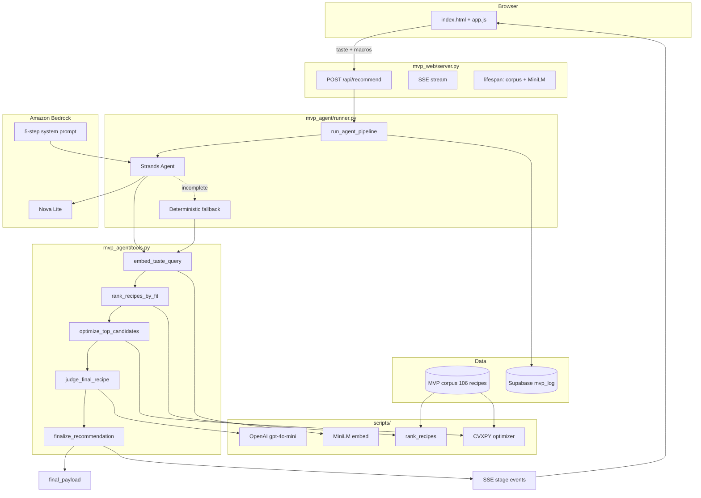
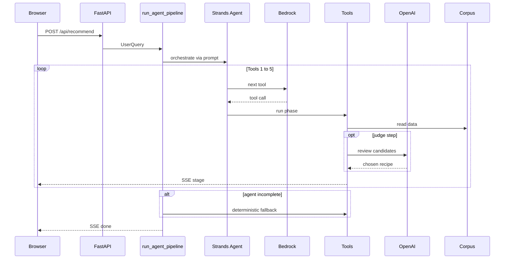

# MVP Strands Agent Architecture

## Component flow

```mermaid
flowchart TB
  subgraph client [Browser]
    UI[index.html + app.js]
  end

  subgraph server [mvp_web/server.py]
    API["POST /api/recommend"]
    SSE[SSE stream]
    Warmup["lifespan: corpus + MiniLM"]
  end

  subgraph runner [mvp_agent/runner.py]
    RAP[run_agent_pipeline]
    SA[Strands Agent]
    FB[Deterministic fallback]
  end

  subgraph orchestrator [Amazon Bedrock]
    BR["Nova Lite"]
    PROMPT[5-step system prompt]
  end

  subgraph tools [mvp_agent/tools.py]
    T1[embed_taste_query]
    T2[rank_recipes_by_fit]
    T3[optimize_top_candidates]
    T4[judge_final_recipe]
    T5[finalize_recommendation]
  end

  subgraph backends [scripts/]
    EMB[MiniLM embed]
    RANK[rank_recipes]
    OPT[CVXPY optimizer]
    JUDGE["OpenAI gpt-4o-mini"]
  end

  subgraph data [Data]
    CORPUS[(MVP corpus 106 recipes)]
    DB[(Supabase mvp_log)]
  end

  UI -->|taste + macros| API
  API --> RAP
  RAP --> SA
  SA --> BR
  PROMPT --> SA

  SA --> T1 --> T2 --> T3 --> T4 --> T5
  T1 --> EMB
  T2 --> RANK
  T3 --> OPT
  T4 --> JUDGE
  T5 --> ASSY[final_payload]

  CORPUS --> RANK
  CORPUS --> OPT
  ASYNC[SSE stage events] --> UI
  T5 --> ASYNC
  RAP --> DB

  SA -.->|incomplete| FB
  FB --> T1
```

## Request sequence

```mermaid
sequenceDiagram
  participant U as Browser
  participant S as FastAPI
  participant R as run_agent_pipeline
  participant A as Strands Agent
  participant B as Bedrock
  participant T as Tools
  participant O as OpenAI
  participant C as Corpus

  U->>S: POST /api/recommend
  S->>R: UserQuery
  R->>A: orchestrate via prompt

  loop Tools 1 to 5
    A->>B: next tool
    B-->>A: tool call
    A->>T: run phase
    T->>C: read data
    opt judge step
      T->>O: review candidates
      O-->>T: chosen recipe
    end
    T-->>U: SSE stage
  end

  alt agent incomplete
    R->>T: deterministic fallback
  end

  R-->>U: SSE done
```
