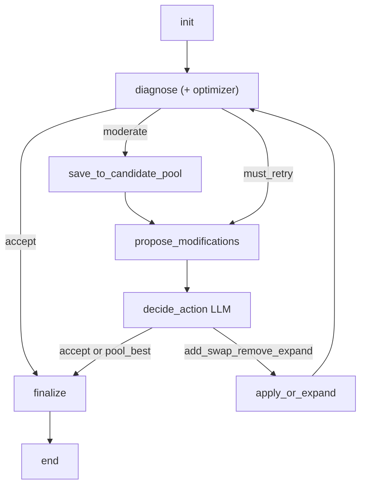

# Recipe optimization agent

LangGraph loop: retrieve/diagnose (hull + optimizer + IQR fidelity bands) → accept / save-and-retry / must-retry → **auto-apply clear LP favorite** or LLM `decide_action` (tiered models) → add/swap/remove/expand with dish-identity checks.

## Model tiers

| Node | Default | Role |
|------|---------|------|
| Tags | `gpt-4.1-nano` | Classify/extract when lexical is empty/ambiguous |
| Routine decide | `gpt-4o-mini` | First visit, clear improving choice |
| Uncertain decide / revisit | `gpt-4.1-mini` (`model_escalate`) | Near-ties, reflection, identity/dietary tension |
| Draft | `gpt-4.1-mini` (`creative_model`) | Creative warm-start |
| Judge | `gpt-4.1-mini` (`judge_model`) | Near-tie finalists only |

**Why not gpt-4o by default:** `gpt-4.1-mini` is cheaper and faster with strong instruction-following for structured JSON. Keep `gpt-4o` as an override for A/B:

```bash
PYTHONPATH=scripts:. uv run python tests/eval_complex_model_ab.py
```

Prefer **4.1-mini** unless 4o wins on ≥2 of {tag safety, final L/composite, LP agreement, draft identity}.

## Decision briefing + auto-apply

`decide` receives a **curated DecisionContext** (compact diagnosis, hull summary, annotated top bundles, tradeoff frame, last outcomes / revisit reflection) — not a raw dump.

When the top LP-evaluated, tag-safe bundle is strictly improving (`delta_L_star < -ε`) and beats #2 by `auto_apply_margin`, the graph **auto-applies** (`decide_auto`) and skips the LLM.

## Telemetry

Each run carries `run_telemetry` (also on `final` / SSE): LLM vs auto-apply counts, final 3-way needles (ratio / nutrient / holistic), per-node snapshots, post-apply deltas. Use it to tune margins vs rewrite prompts.

**Metric classes:** `ACTIONABLE_METRICS` (accept/fidelity/controller/cost) vs `OBSERVABILITY_METRICS` (FoodOn aggregation depth/hits, neighborhood size, path churn). Both post to LangSmith feedback with `class=…` comments. Run metadata includes mode, query, macro box, `F_accept`/`F_max`/`max_iterations`, graph nodes/edges, and per-stage models — see [`docs/recipe_opt_agent_langsmith.md`](recipe_opt_agent_langsmith.md).

**Final UI scores:** ratio loss (neighborhood pasta∶egg surrogate), nutrient loss (PFC box slack), and holistic 0–10 (LLM judge preferred), color-banded using absolute priors + sparse eval anchors. Final ingredient grams render above the gpt-4o summarizer.

**OOD protein branch:** when protein demand is high (`high_protein` tag, high `protein_min`, binding `protein_min`, or large protein gap), `propose` scores a parallel `ood_protein` branch (chicken breast / tofu / …) plus `hybrid` ID⊕OOD bundles. Strong / shortlisted / OOD hits are archived in `interesting_candidates` for end-of-run finalist evaluation.

**FoodOn basis report:** every problem / proposed `next_problem` / pool entry / final payload includes `foodon_basis_report` — which ingredients roll up (and by how many FoodOn levels), the active basis nodes, and neighborhood hit counts per node (`n_hits` ≈ share-sample count). Use this to judge neighborhood coarseness and ratio-loss signal quality. See [`recipe_opt_agent/foodon_basis_report.py`](../recipe_opt_agent/foodon_basis_report.py).

**Full eval artifacts + LangSmith:** see [`docs/recipe_opt_agent_langsmith.md`](recipe_opt_agent_langsmith.md). Run:

```bash
PYTHONPATH=scripts:. uv run python tests/run_eval_suite.py          # offline + local artifacts
PYTHONPATH=scripts:. uv run python tests/run_eval_suite.py --live   # + OpenAI (+ LangSmith if enabled)
```

**Web UI:** after a run finishes, use **Summarize this run (gpt-4o)** under Final result for a holistic step-by-step review (UI-only; uses `OPENAI_API_KEY`). The flow diagram routes edges so `diagnose → finalize` no longer looks like `propose → finalize`.

## Modes

| Mode | Entry | Use when |
|------|-------|----------|
| **Neighborhood** | Canonical dropdown → nutrition-close NLG start | Classic dishes, eval baseline |
| **Creative / OOD** | User request → LLM draft → FDC grounding → same diagnose loop | High-protein carbonara, custom macros, open-ended taste |

Creative mode adds: `requirement_tags` (hard constraints), soft candidate pool save, Pareto + weighted scoring (0.4 nutrient / 0.3 ratio / 0.2 intent / 0.1 churn), optional LLM judge among tied survivors.

## Flow



**Where is the optimizer?** Inside `diagnose`. That node runs conical hull geometry (`region_intersects_hull`), then the weighted empirical LP (`optimize_weighted_empirical_obj`), then IQR fidelity bands / retry triggers. It is not a separate LangGraph step; every time the graph returns to `diagnose` after `apply`, the optimizer re-solves on the updated ingredient basis.

## Slot → bundle propose pipeline

`propose` is a single graph node that runs three internal stages (each emitted as a tool event, visible in Live steps):

1. **`plan_slots`** ([`recipe_opt_agent/slot_planner.py`](../recipe_opt_agent/slot_planner.py)) — turn the diagnosis into ≤2 structured edit slots: RED/over share term → `remove_outlier` (or `fix_share` dilute-add if identity-critical), RED/under → `fix_share` add, binding macros / LP infeasible → `macro_gap`, box outside hull → `open_hull`, forbid-tag violation on a current line → `dietary_swap` (highest priority).
2. **`retrieve_slots`** (`retrieve_for_slot` in [`scripts/augmentation_retrieve.py`](../scripts/augmentation_retrieve.py)) — per-slot shortlists from the neighborhood FDC catalog with co-occurrence + geometry plus two cheap proxies: **share-dilution** (post-edit Wasserstein on basis shares, no LP) and **nutrient-direction** (candidate PFC alignment with the gap to the box center). Swaps are real (replace line *i* with a catalog food), not just add/remove.
3. **`score_bundles`** ([`recipe_opt_agent/bundle_scoring.py`](../recipe_opt_agent/bundle_scoring.py)) — enumerate compatible 1–2 edit bundles (one candidate per slot, ≤50), proxy-rank, then re-run the joint LP on the top 10 to get `L*_before → L*_after` with ratio/nutrient decomposition. Each LP-scored bundle carries a fully materialized `next_problem` (new `x0`, `M` columns, `ingredient_basis`, updated ingredients).

`decide` may return `action=apply_bundle` + `chosen_bundle_id` (the heuristic picks the tag-safe bundle with the most negative `delta_L_star`); single `add/swap/remove` still works as a size-1 bundle. `apply` **atomically replaces the problem** with the bundle's `next_problem` (single candidates get one materialized live via `apply_edits_to_problem`), so the next `diagnose` re-solves on the mutated basis — the old "stub apply" that only set `last_applied` remains only as a fallback when a candidate has no macro data.

## Three-band fidelity

| Band | Meaning |
|------|---------|
| `accept` | Final answer |
| `moderate` | Save to `candidate_pool` and try another modify loop |
| `must_retry` | Not acceptable; must modify or expand |

Thresholds: `F_accept` / `F_max` on `L_max_norm` (IQR-normalized), plus red-count rules in [`scripts/opt_diagnosis.py`](../scripts/opt_diagnosis.py).

## Soft nutrition box

The optimizer uses soft PFC bounds by default (`AgentConfig.nutrition_slack_weight = 1.0`):

`objective = ratio_loss + nutrition_slack_weight × L1_distance_outside_PFC_box`

The slack is measured in calorie-fraction units, not kcal. This lets the LP accept a small
macro-box miss when it materially improves recipe-like ingredient ratios. Set
`nutrition_slack_weight=None` to restore hard PFC constraints.

The same-ingredient GPT comparison supports `--target-box-half-width` and `--slack-weight`.
The prior GPT-5.5 fixed-ingredient run can be replayed without API calls:

```bash
RECIPE_DATA_SOURCE=local PYTHONPATH=scripts:. uv run python \
  scripts/tune_slack_vs_prior_llm.py
```

## Dish identity

Identity roles = **title templates ∪ lexical dish cues ∪ optional LLM extract** (merged in `identity_roles.py`). Removes cannot target identity-critical lines. Swaps require LLM `preserves_dish` + `acceptable_variant` when the controller runs.

## Similarity

`score = 0.50 FoodOn + 0.35 semantic + 0.15 cuisine` ([`scripts/recipe_similarity.py`](../scripts/recipe_similarity.py)).

## Basis cutoff + neighborhood expansion

The mass-share basis needs enough samples per FoodOn node. A fixed hit floor is wrong (thin dishes never reach it; big dishes over-filter), so the cutoff is **adaptive**: `min_hits = clamp(ceil(0.20·N), 3, 15)` ([`adaptive_min_basis_hits`](../scripts/canonical_optimization.py)).

When a neighborhood is still thin (`N < 40`), [`scripts/neighborhood_expansion.py`](../scripts/neighborhood_expansion.py) adds a similarity-ranked **shell** of extra recipes (FoodOn nearest-core Jaccard + embedding cosine, anchored on the dish's cut nodes so identity is preserved). Shell recipes are **down-weighted** (`weight = shell_weight·similarity`, core = 1.0). The weights ride through the empirical CDF loss and the LP objective via `basis_sample_weights` (uniform when absent, so all other paths are unchanged). Shell membership + weights are cached inside `build_params`/`basis_shares`; expansion uses the local cap40 store and is skipped on a DB backend. Bumped `NEIGHBORHOOD_CACHE_VERSION = 2`.

## Modules

| Path | Role |
|------|------|
| `scripts/weighted_empirical_opt.py` | Marginal + ratio LP |
| `scripts/hull_geometry.py` | Conical hull / H∩T |
| `scripts/loss_field.py` | `L(p)=min obj` grid + cache |
| `scripts/opt_diagnosis.py` | Zones + bands |
| `scripts/recipe_similarity.py` | FoodOn/semantic/cuisine |
| `scripts/augmentation_retrieve.py` | Candidate shortlist + slot retrieval + proxies |
| `recipe_opt_agent/slot_planner.py` | Diagnosis → ≤2 edit slots |
| `recipe_opt_agent/bundle_scoring.py` | Bundle enumeration + joint LP + `next_problem` |
| `recipe_opt_agent/model_policy.py` | Per-node model tier selection |
| `recipe_opt_agent/telemetry.py` | Run telemetry + clear-favorite + needles |
| `recipe_opt_agent/identity_roles.py` | Template ∪ lexical ∪ LLM identity roles |
| `recipe_opt_agent/requirement_tags.py` | Hard dietary tags + filters |
| `recipe_opt_agent/grounding.py` | LLM draft → FDC problem |
| `recipe_opt_agent/candidate_scoring.py` | Pareto + weighted composite |
| `recipe_opt_agent/creative_loader.py` | Creative problem stub / DB context |
| `recipe_opt_agent/` | LangGraph agent + CLI |

## CLI

```bash
# Offline fixture
PYTHONPATH=scripts:. uv run python -m recipe_opt_agent --fixture tests/fixtures/recipe_opt/synthetic_problem.json --out scratch/recipe_opt_runs/demo.json

# Live CanonicalNeighborhood (local cap40 store by default; set RECIPE_DATA_SOURCE=db for Supabase)
PYTHONPATH=scripts:. uv run python -m recipe_opt_agent --canonical-id 443 --taste "classic carbonara"
```

## Local recipe store (cap40)

Agent/web paths default to **local** parquet under `Data/recipe_local_store/cap40/` (gitignored under `Data/`).

```bash
# One-time download from Supabase (cap40 recipes only)
PYTHONPATH=scripts python scripts/download_cap40_recipe_store.py

# Toggle
export RECIPE_DATA_SOURCE=local   # default — no Supabase
export RECIPE_DATA_SOURCE=db      # hit Postgres
# optional: export RECIPE_LOCAL_STORE=/path/to/store
```

Access layer: [`scripts/recipe_data_access.py`](../scripts/recipe_data_access.py) (`get_store()`).

## Playgrounds

| Surface | How to run |
|---------|------------|
| Web UI (SSE + flow graph) | `PYTHONPATH=scripts:. uv run python -m recipe_opt_web` → http://127.0.0.1:8010 |
| Notebook (raw data) | [`notebooks/recipe_opt_agent_sandbox.ipynb`](../notebooks/recipe_opt_agent_sandbox.ipynb) |

Canonical recipe picker: search the **full** catalog via `GET /api/canonicals/search?q=…` (UI combobox). `GET /api/canonicals` returns the full list when no `limit` is set; `?count_only=1` returns total count only.

**Why neighborhood load felt slow:** it was not “filter matches.” `CanonicalNeighborhood.build` also loads FoodOn caches and (previously) ran a combinatorial Jaccard antichain search over cut nodes, then scored start recipes with per-recipe DB macro loads. The web UI and agent both call `load_canonical_problem` → `CanonicalNeighborhood.build(use_cache=True)`, so precomputed rows in `recipe.canonical_neighborhood_cache` are used when present; on miss, `fast=True` skips Jaccard. Start recipe uses batch L1 PFC or optional `loss_projection` from `recipe.recipe_loss_fields` (falls back to L1 if empty). Load SSE / chosen-recipe panel report cache hit vs miss. FoodOn caches warm on server startup.

Inputs: mode (neighborhood | creative), user request (creative), canonical id, PFC min/max, `F_accept` / `F_max`, max iterations.

Creative mode shows finalist metric cards (normalized goodness + composite) in the result panel.

Both surfaces stream each LangGraph node. The web UI keeps a compact step summary and adds:
- **More context** dropdown per step (tools, candidates, slots, bundles, hull distance, prompts, full JSON)
- optional **full transcript** side panel (`prompt` / `tool` / `llm_response` / `reasoning` / `retry_trigger`)
- for `must_retry` / `moderate`: which metric fired and the threshold needed to clear it
- hull **outside_score** / box→hull distance when the target is outside H∩T

**Flow graph:** the agent graph is a larger directed SVG with arrowhead edges (backward loop edges bow above the nodes). Clicking a node opens an **on-node popover** with the node's purpose, its tools (`tools: [{name, purpose}]` from `/api/flow` docs), and its incoming/outgoing edges; Esc or clicking outside closes it. The old below-graph docs list is gone — `/api/flow` now attaches `tools`, `incoming`, and `outgoing` per node for both modes.

## Tests

```bash
uv run pytest tests/test_hull_geometry.py tests/test_opt_diagnosis.py tests/test_recipe_similarity.py tests/test_recipe_opt_agent_graph.py -q
```

## Pitfalls

- Loss-field grid is expensive; default `loss_field_grid_n=11` and off unless `problem.compute_loss_field=true`.
- LLM never invents ingredients; candidates must be on `modification_candidates`.
- Without `OPENAI_API_KEY`, decisions use a deterministic heuristic (for tests/CI).
